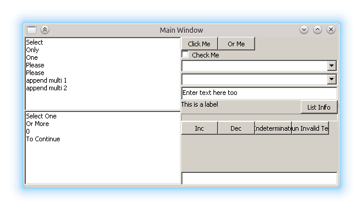
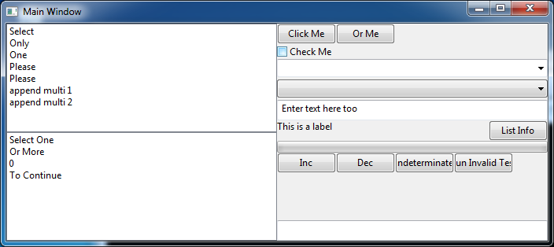
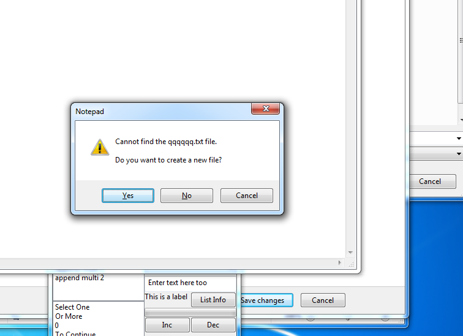
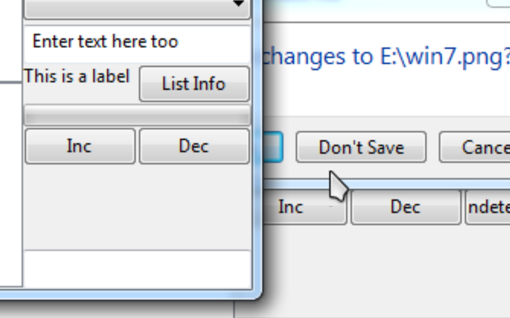

**Problem**: By default, when creating a window by hand in code, the window has the built-in System font, a holdover from WIndows 2.0 that's still the default for... some reason. The font must be manually changed with a `WM_SETFONT` message.

So what font do we use if we want to use the font that all programs on the system uses, regardless of Windows version? With resource files (especially those created by Visual Studio) and dialog boxes, we typically just let the resource file dictate the font, either explicitly or with one of the dialog styles. And it was not until Windows Vista that Microsoft finally wrote up a proper set of human interface guidelines for Windows, which dictates the font... for Vista and up.

The only real thing I could find, from multiple placeso n MSDN and MSDN blogs and elsewhere, is that we call SystemParametersInfo() to get the non-client metrics, and then from there get the font used by message boxes.

However, simply using the right font isn't the only issue. The new HIG includes [a section on proper control sizes](http://msdn.microsoft.com/en-us/library/windows/desktop/aa511279.aspx#sizingspacing), with sizes specified in dialog units, and pixel conversions for Segoe UI provided. Dailog unit conversion depends on the font: GetDailogBaseUnits() still uses that old System font, and because I'm not using a dialog box, I can't use MapDialogRect(). I CAN do the calculations manually, as they are listed on MapDialogRect()'s MSDN page, so I do.

Here's what my test program looks like in wine and on Windows XP:

You'll see that controls are more or less tightly packed here and that buttons look ... right.

Now here's what happens on WIndows 7:

Buttons look taller than what Microsoft says, and so are other controls like combo boxes, which now appear to have more padding? Unless my eyes are fooling me for the second part...

And compared to other things on the system:

You'll see here that some, but not all, other Segoe UI buttons use the correct smaller size, but some use the larger size...

So which is right?

Thanks.
